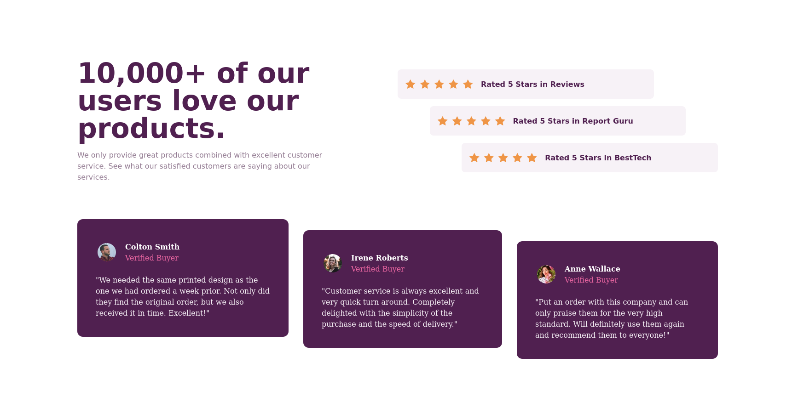

# Frontend Mentor - Social proof section solution

This is a solution to the [Social proof section challenge on Frontend Mentor](https://www.frontendmentor.io/challenges/social-proof-section-6e0qTv_bA). Frontend Mentor challenges help you improve your coding skills by building realistic projects. 

## Table of contents

- [Overview](#overview)
  - [The challenge](#the-challenge)
  - [Screenshot](#screenshot)
  - [Links](#links)
- [My process](#my-process)
  - [Built with](#built-with)
  - [What I learned](#what-i-learned)
  - [Continued development](#continued-development)
  - [Useful resources](#useful-resources)
- [Author](#author)
- [Acknowledgments](#acknowledgments)

## Overview

### The challenge

Users should be able to:

- View the optimal layout for the section depending on their device's screen size

### Screenshot



### Links

- Live Site URL: [Add live site URL here](https://trinhlehainam.github.io/socialproofchallenge/)

## My process

### Built with

- Semantic HTML5 markup
- CSS custom properties
- Flexbox
- CSS Grid
- Mobile-first workflow
- [Tailwind CSS](https://tailwindcss.com/) - CSS framework

### What I learned

I learned 2 solutions with tailwind sematic to align flex items: 
- Use self-[end, center, start] to set flex item base on flex-axis.
- Use translate-[x or y]-[number] to move items to new position.

```html
<div class="... self-center">
<div class="... translate-y-12">
```

### Continued development

### Useful resources

- [Align flex items](https://developer.mozilla.org/en-US/docs/Web/CSS/CSS_Flexible_Box_Layout/Aligning_Items_in_a_Flex_Container) - This helps how to align flex items.

## Author

- Frontend Mentor - [@trinhlehainam](https://www.frontendmentor.io/profile/trinhlehainam)

## Acknowledgments
